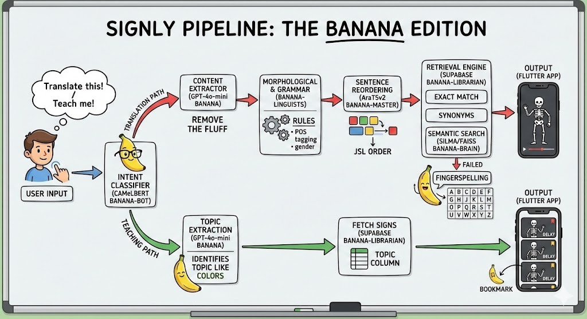

# **Signly**

Signly is an educational and assistive application designed to make **Arabic Sign Language (ArSL)** more accessible.  
It helps users translate written Arabic input into sign language (specifically Jordanian) and also provides interactive teaching modules to learn sign language topics step by step.  

The system is intent-aware: it distinguishes between direct translation requests and pedagogical requests, ensuring both communication and learning are supported.

The animated skeletons used in the outputs were generated from human-signer videos using MediaPipe. (`video_processing_scripts/mediapipe_extract_and_render.py`)

More details will be added with each update. The project is still under development.
---

## Application Flow
Signly orchestrates two main paths: **Translation** and **Teaching**.

### Translation Path
1. **Intent Classifier (Fine-tuned CAMeLBERT)**: determines whether the user wants translation or teaching.  
2. **Content Extractor (GPT-4o-mini)**: removes fluff, extracts meaning.  
3. **Morphological & Grammar Rules**: applies POS tagging, gender, and syntax.  
4. **Sentence Reordering (Fine-tuned AraT5v2)**: arranges text into Jordanian Sign Language (JSL) order.  
5. **Retrieval Engine (Supabase + FAISS/SILMA)**: finds matching signs via exact match, synonyms, or semantic search.  
6. **Fallback Support**: if a sign isn’t found:  
   - First, the system reverts to **semantic search** to approximate meaning.  
   - If semantic search fails to meet the threshold, it finally reverts to **fingerspelling** to ensure communication continuity.  
7. **Output**: delivered to the Flutter app as animated skeletons performing the signs.

### Teaching Path
1. **Intent Classifier (Fine-tuned CAMeLBERT)**: routes to teaching mode.  
2. **Topic Extraction (GPT-4o-mini)**: identifies topics (e.g., colors).  
3. **Fetch Signs (Supabase)**: retrieves signs by topic.  
4. **Output**: shown in the Flutter app with options for delay and bookmarking.

---

## Expected Output

The expected outcome is a functional text-to-sign language application that accepts written Arabic input and produces corresponding **ArSL**, with Jordanian Sign Language (JSL) as a representative dialect.  

- The system operates in an **intent-aware manner**, distinguishing between direct translation requests and category-based retrieval requests.  
- For **translation-oriented inputs**, the system generates a grammatically aligned sign sequence that reflects ArSL sentence structure, incorporating:  
  - Morphological analysis  
  - Semantic inference for unsupported or unseen vocabulary  
  - Sentence reordering  
- For **teaching requests**, the system retrieves and presents relevant sign categories or isolated signs to support learning and teaching use cases.  
- The final output is rendered through **animated signing skeletons**, providing a clear and interpretable visual representation of the intended meaning.  

---

## Tech Stack
- **Frontend**: Flutter (cross-platform app with animated skeletons)  
- **Backend**: FastAPI (Python)  
- **Database**: Supabase + SQLAlchemy  
- **NLP Models**: Fine-tuned CAMEelBERT, Fine-tuned AraT5v2, GPT-4o-mini  
- **Semantic Search**: FAISS / SILMA  
- **Auth**: JWT-based authentication  
- **Deployment**:   

---

More details will be added with each update. The project is still under development.