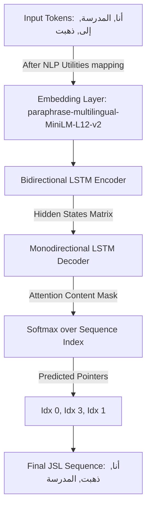
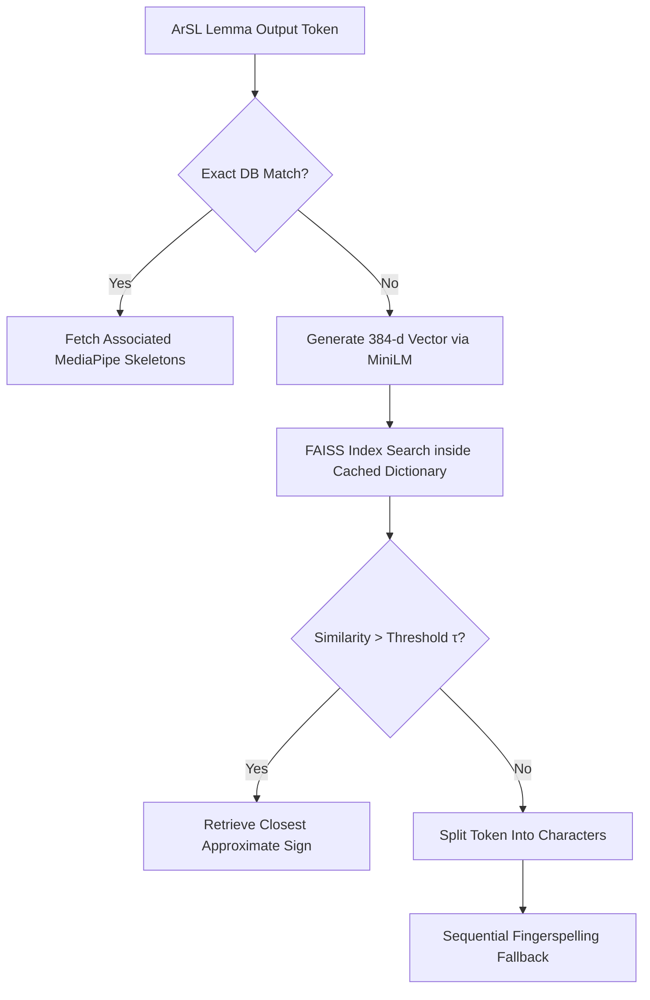

# **Signly**

Signly is an educational and assistive application designed to make **Arabic Sign Language (ArSL)** more accessible.  
It helps users translate written Arabic input into sign language (specifically Jordanian) and also provides interactive teaching modules to learn sign language topics step by step.  

The system is intent-aware: it distinguishes between direct translation requests and pedagogical requests, ensuring both communication and learning are supported.

The animated skeletons used in the outputs were generated from human-signer videos using MediaPipe (`video_processing_scripts/mediapipe_extract_and_render.py`).

---

## Application Flow
Signly orchestrates two main paths: **Translation** and **Teaching**.

### Translation Path
1. **Intent Classifier (Fine-tuned CAMeLBERT)**: Determines whether the user wants translation or teaching.  
2. **Content Extractor (GPT-4o-mini)**: Removes fluff and extracts core meaning.  
3. **Morphological & Grammar Rules**: Applies POS tagging, gender, tense, and syntax handling.  
4. **Sentence Reordering (Pointer Network Subnetwork)**: Rearranges parsed text lemmas into Jordanian Sign Language (JSL) grammatical order.  
5. **Retrieval Engine (Supabase + FAISS/SILMA)**: Finds matching signs via exact match, synonyms, or semantic search.  
6. **Fallback Support**: If a sign isn’t found:  
   - First, the system reverts to **semantic vector search** to approximate meaning.  
   - If semantic search fails to meet the similarity threshold, it finally drops down to **fingerspelling** to ensure communication continuity.  
7. **Output**: Delivered to the Flutter app as animated skeletons performing the signs.

### Teaching Path
1. **Intent Classifier (Fine-tuned CAMeLBERT)**: Routes the input to teaching mode.  
2. **Topic Extraction (GPT-4o-mini)**: Identifies specific pedagogical categories (e.g., colors, numbers).  
3. **Fetch Signs (Supabase)**: Retrieves the associated collection of signs categorized by topic.  
4. **Output**: Shown in the Flutter app with tailored options for playback speed delay and bookmarking.

---

## Core Technical Subsystems

### 1. NLP Morphological Utilities (`app/core/nlp_utils.py`)
The initial stage of the text-to-sign pipeline converts Modern Standard Arabic (MSA) or Jordanian colloquial text into an unstructured sequence of standardized lemmas via advanced grammatical parsing.

* **Text Standardization & Normalization:** Implements deterministic Unicode mapping, Alef/Maksura unification, and absolute de-diacritization using `camel_tools.utils.normalize` and `dediac_ar`.
* **Tokenization & Disambiguation:** Uses a pre-trained Mixed Maximum Likelihood Estimation Disambiguator (`MLEDisambiguator`) to parse parts of speech (POS) and morphosyntactic properties dynamically.
* **Rule-Based Grammar Mapping:** Filters out structural noise (stops, relative pronouns, specific prepositions, and coordinate conjunctions) while converting essential grammatical attributes directly into visual lexical indicators:
    * **Aspect (Tense):** Map Past (`asp=p`) -> "قبل", Present/Imperfective (`asp=i`) -> "الآن", Command (`asp=c`) -> "لازم", and Future (`prc0=fut_s` / "سوف") -> "قريباً".
    * **Number:** Detects Dual morphs (`num=d`) -> appends "اثنان", and Plurals (`num=p`) -> appends "كثير".
    * **Gender:** Recognizes Rational Feminine constructions (`gen=f` and `rat=y`) -> explicitly inserts "بنت".
    * **Interrogatives & Negation:** Tracks question words (e.g., transforming "لماذا" to cause "سبب") and negation components ("لا"), appending them structurally to the end of sentences following ArSL/JSL conventions.
    * **Verbal Aspect Iteration:** Evaluates specific adverbial phrases (e.g., "مراراً وتكراراً") to automatically trigger verbal repetition blocks (3x loop sequence) directly inside the token stream.
* **State-Driven Vocab Optimization:** Loads runtime-accessible signs and keyword n-grams directly from Supabase via `SessionLocal` at system initialization to minimize redundant database round-trips.

---

### 2. Syntactic Sentence Reordering Engine
Instead of utilizing generic sequence-to-sequence generation models, Signly handles structural shifting by formulating sentence reordering as a **Combinatorial Permutation Optimization** problem via a custom **Pointer Network Architecture**. This restricts model outputs exclusively to words present in the input stream, preventing hallucinatory text errors.

#### Architecture Mechanics
* **Encoder Subnetwork:** A Deep Bidirectional Long Short-Term Memory network (2x LSTM) processing dense inputs extracted through a Frozen 384-dimensional `paraphrase-multilingual-MiniLM-L12-v2` Sentence Transformer backbone.
* **Decoder Subnetwork:** A single-direction LSTM that tracks previous index pointer decisions step-by-step.
* **Pointer Attention Mechanism:** Implements a parameterized alignment scoring routine that evaluates encoder hidden vectors against the current decoder hidden state, passing the resulting score through a Softmax function to yield a clean probability distribution over input index positions. A tracking mask sets previously picked positions to negative infinity to avoid duplicate assignments.

#### Model Tuning & Evaluation Pipeline
* **Dual-Dialect Evaluation Tracks:** Maintained explicitly as independent training configurations across Modern Standard Arabic (MSA) targets and localized Jordanian Sign Language (JSL) datasets.
* **Loss Profile Optimization:** Modeled over Cross-Entropy metrics using L2 Weight Decay (1e-4) and explicit Dropout (0.3) layers. Includes an early stopping patience mechanism (10 epochs) tracking generalized validation losses to prevent overfitting.
* **Rigorous Statistical Validation:** Performance outputs on unseen test sets are reported along with 95% Bootstrap Confidence Intervals across standard metrics:
    * **Sequence-level accuracy:** Exact Match (EM) percentage, Word Error Rate (WER), and Position Error Rate (PER).
    * **Translation metrics:** BLEU-4 and ROUGE-L.
    * **Rank Correlation:** Kendall's Tau, measuring the exact ordering alignment relative to true regional sign syntax.

---

### 3. High-Performance Semantic Retrieval Engine
When the structural reordering pipeline outputs token permutations that do not have an exact token match inside the database, control falls back to a high-speed vector search system to maintain translation continuity.

* **Vectorization Backbone:** Uses the same sentence transformer architecture to convert non-matching target sign terms into dense numerical vectors.
* **In-Memory Similarity Indices:** Uses optimized **FAISS (Facebook AI Similarity Search)** matrices pre-populated with vectorized lexical representations of all Arabic signs and semantic keywords stored in Supabase.
* **Controlled Search Boundary Thresholding:** Employs a strict similarity threshold variable. If a vector calculation returns a proximity distance scoring higher than the threshold, the engine pulls the closest available sign synonym.
* **Fingerspelling Safety Fallback:** If semantic proximities fall completely below the threshold, the retrieval engine drops down to an isolated character decomposition workflow. It splits the token into individual characters, mapping them to standard Arabic alphabet fingerspelling skeletons (**ArSL Alphabet**) to guarantee message delivery.

---

## Expected Output

The expected outcome is a functional text-to-sign language application that accepts written Arabic input and produces corresponding **ArSL**, with Jordanian Sign Language (JSL) as a representative dialect.  

* The system operates in an **intent-aware manner**, distinguishing between direct translation requests and category-based retrieval requests.  
* For **translation-oriented inputs**, the system generates a grammatically aligned sign sequence that reflects ArSL sentence structure, incorporating morphological analysis, semantic inference for unsupported or unseen vocabulary, and deep pointer-based sentence reordering.  
* For **teaching requests**, the system retrieves and presents relevant sign categories or isolated signs to support learning and teaching use cases.  
* The final output is rendered through **animated signing skeletons**, providing a clear and interpretable visual representation of the intended meaning.  

---

## Tech Stack
* **Frontend:** Flutter (cross-platform app with animated skeletons)  
* **Backend:** FastAPI (Python 3.10)  
* **Database & Vector Index:** Supabase (PostgreSQL) + In-Memory FAISS  
* **NLP & Deep Learning Models:** Fine-tuned CAMeLBERT (Intent / NER), PointerNet (Custom PyTorch LSTM Architecture), Fine-tuned AraT5v2, GPT-4o-mini, and `paraphrase-multilingual-MiniLM-L12-v2`
* **Auth:** JWT-based authentication  

---
_Note: More details will be added with each update. The project is still under active development._